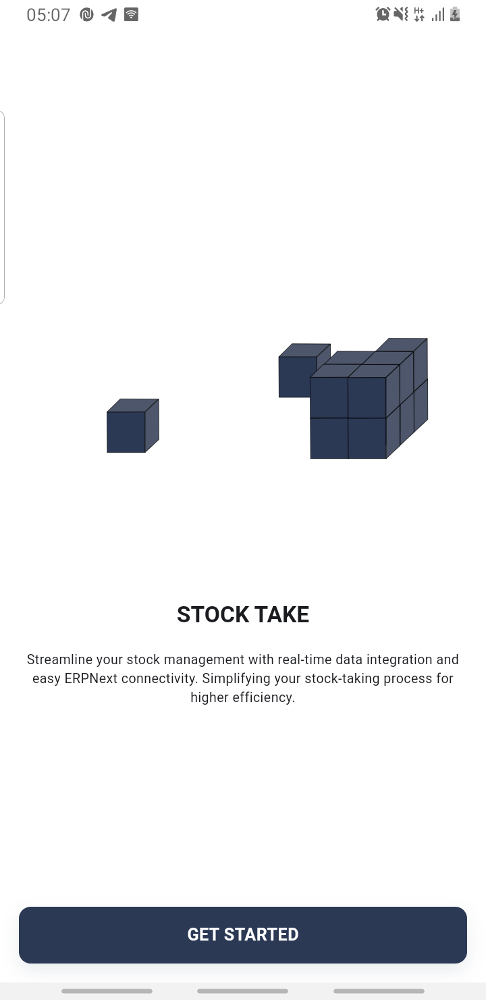
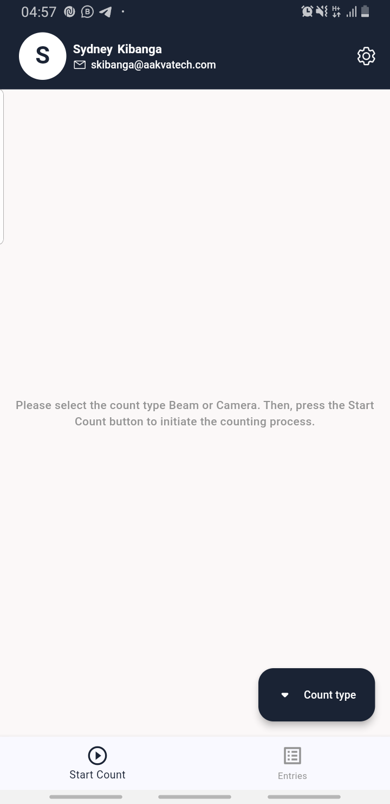
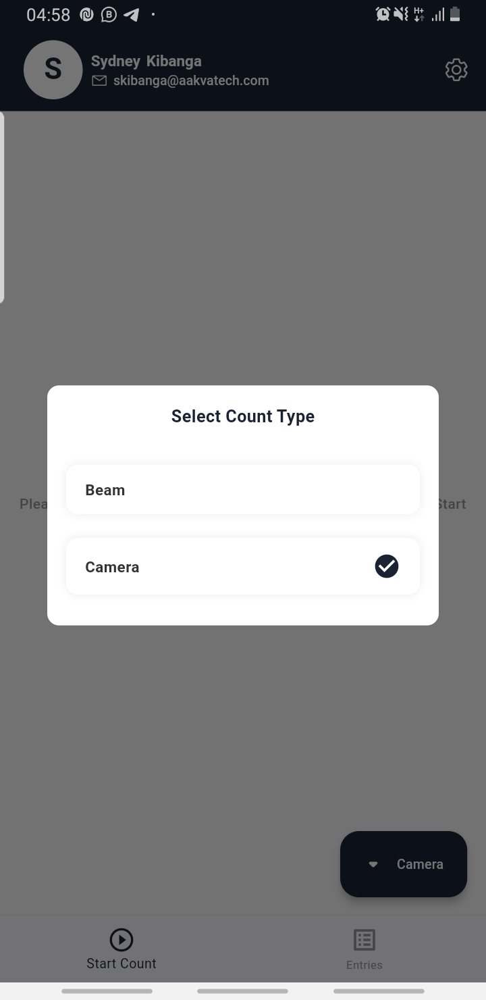
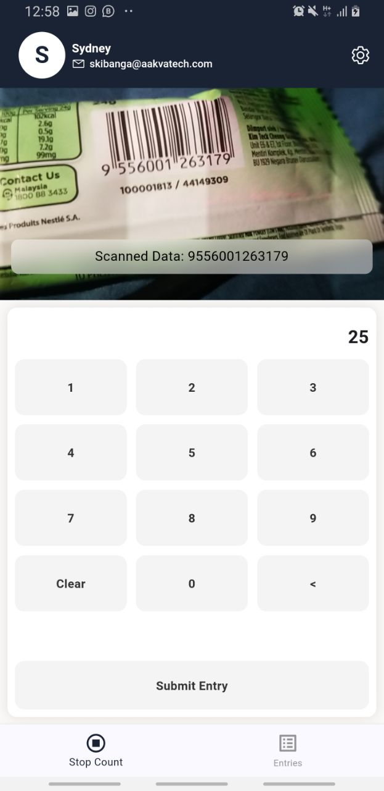
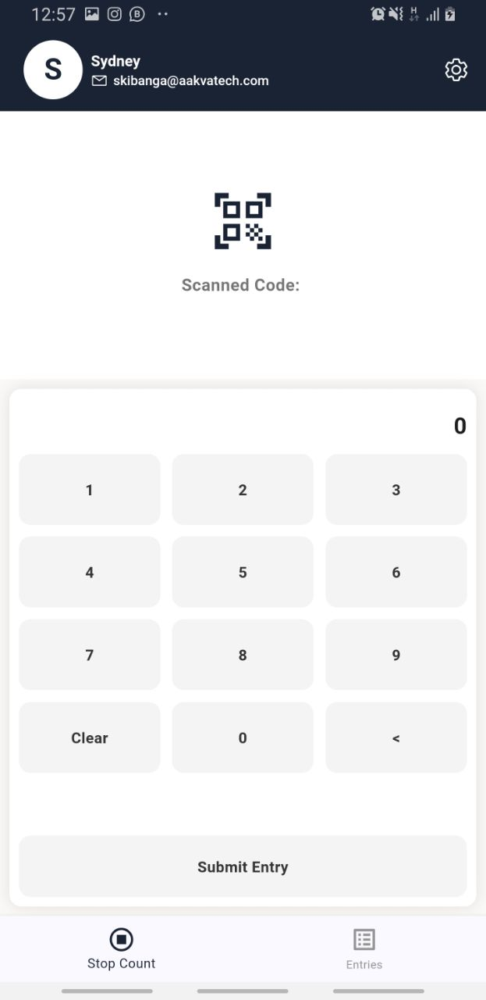
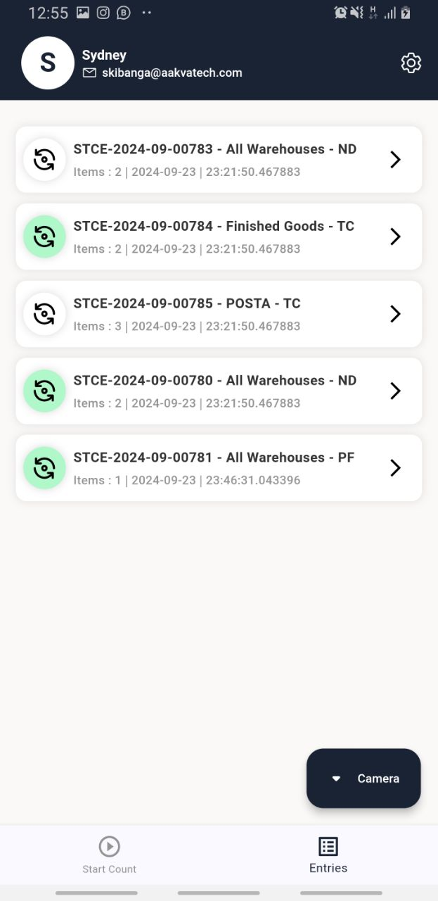
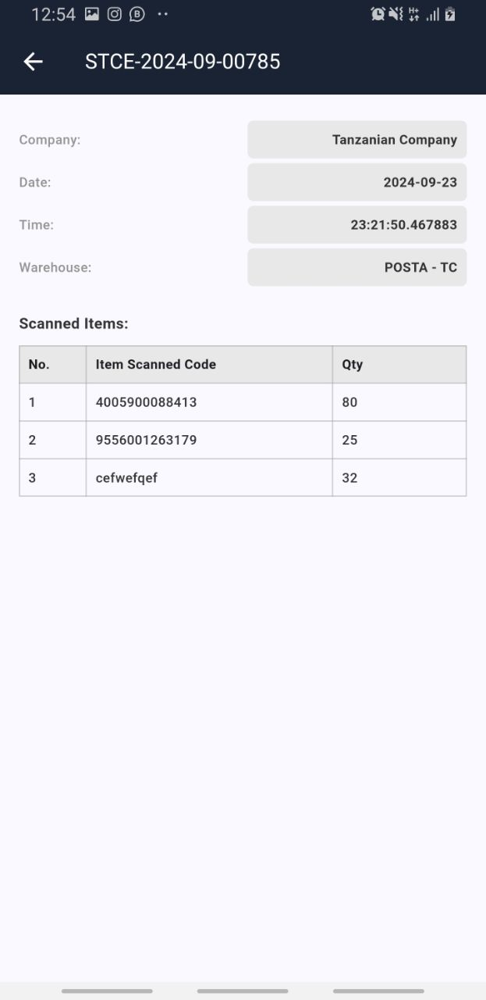
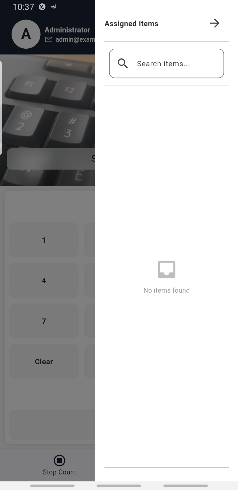
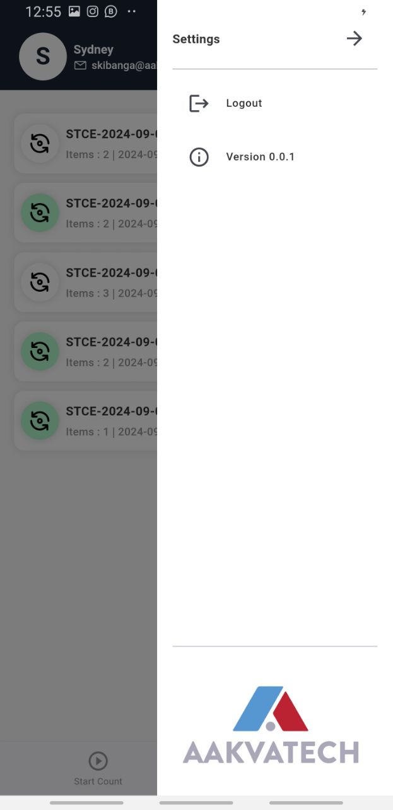

# Stock Take

**Stock Take** is a Flutter-based mobile application that streamlines and enhances the stock-taking process in warehouses. It integrates with Frappe/ERPNext for powerful data management and supports offline operation for environments with limited connectivity.

> **Note:** This app **requires** the [Nex Bridge](https://github.com/Aakvatech-Limited/nex_bridge) application for communication between Flutter and Frappe/ERPNext.

---

## Features

- **Real-Time Data Integration:** Seamlessly connects with Frappe/ERPNext.
- **Offline Operation:** Continue stock-taking without an internet connection.
- **User-Friendly UI:** Built with Flutter for a modern, intuitive experience.
- **Efficient Inventory Management:** Minimizes human errors and streamlines workflows.

---

## Screenshots

Below are sample screenshots demonstrating various parts of the app:

|  |  |  |
|:--------------------------:|:-------------------------------:|:---------------------------:|

|  |  |  |
|:---------------------------:|:-----------------------:|:---------------------------------:|

|  |  |  |
|:--------------------------------------:|:--------------------------------------:|:-----------------------------:|

---

