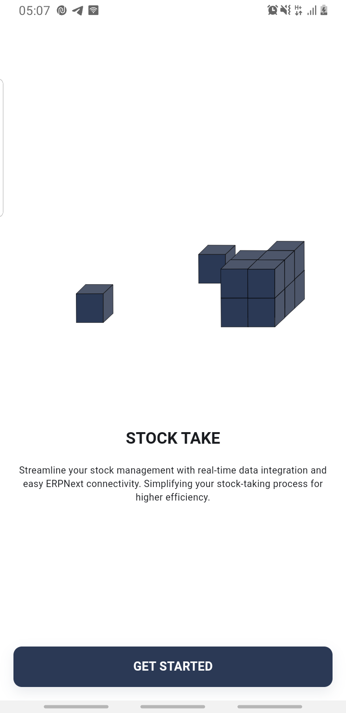
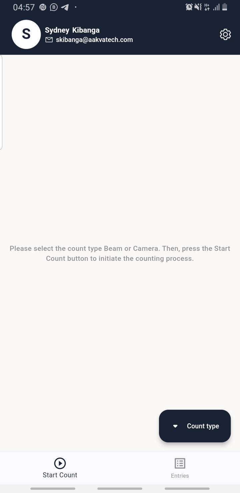
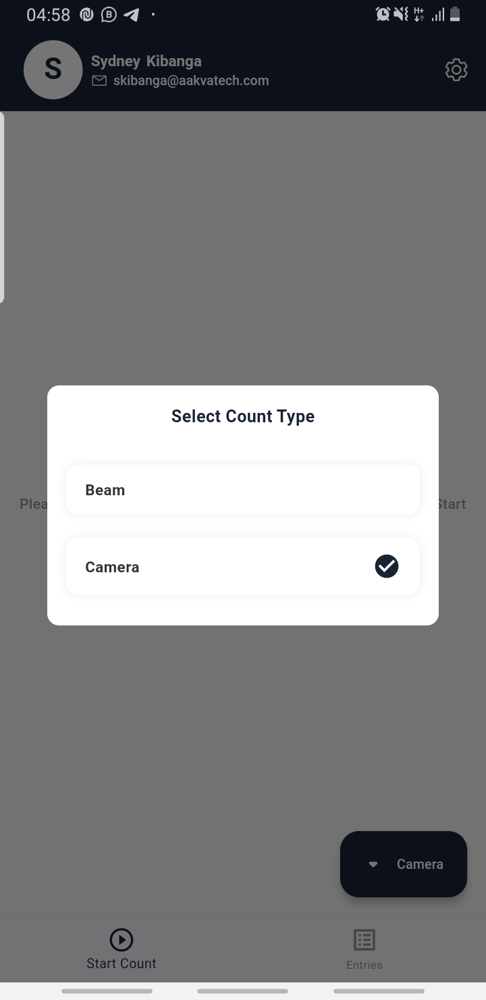
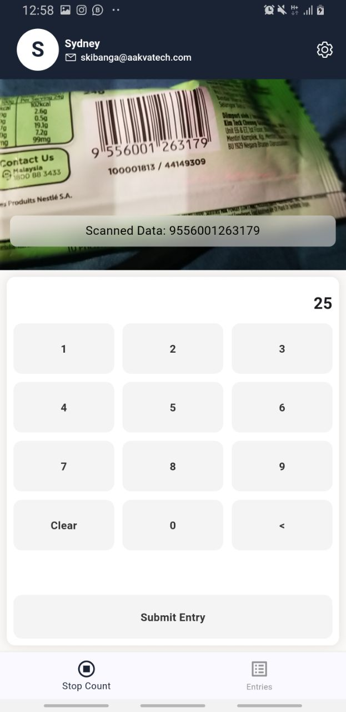
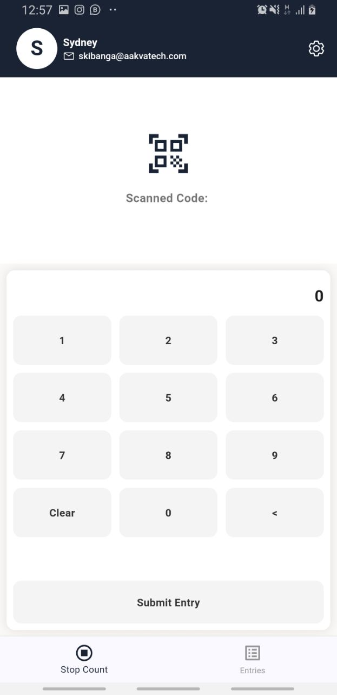
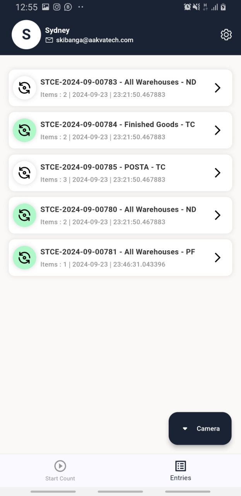
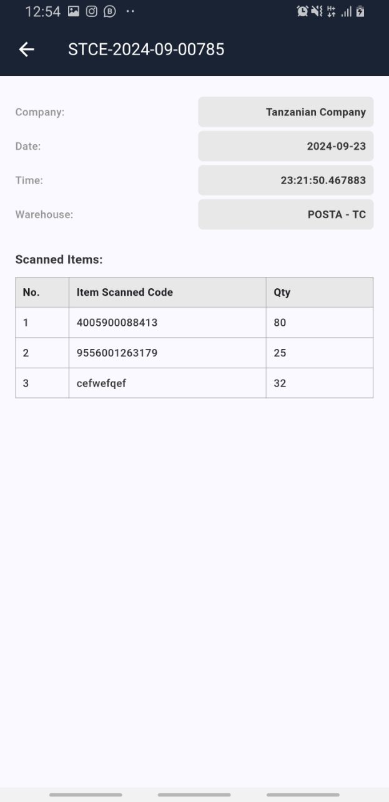
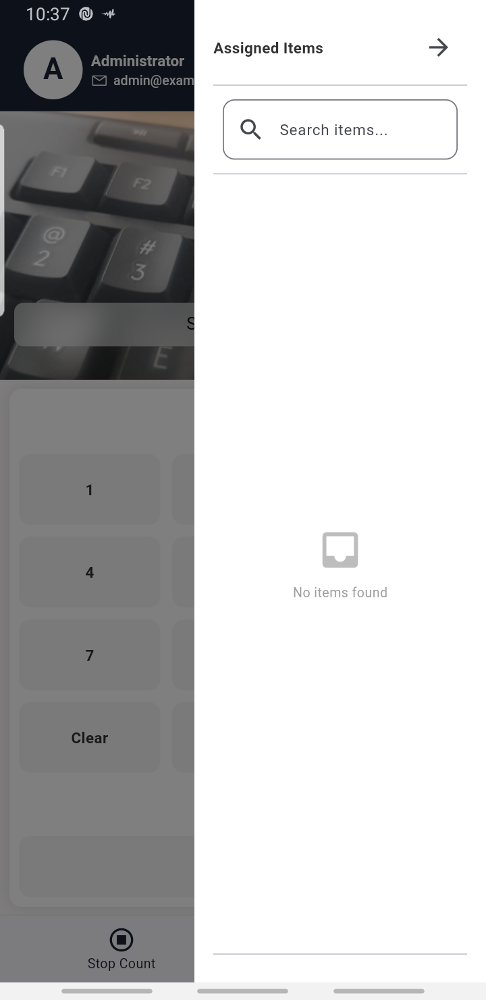
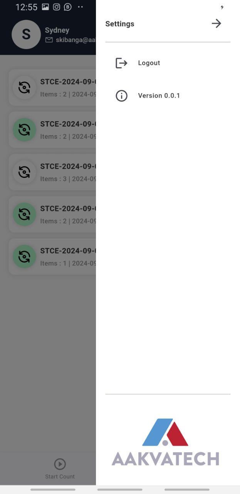

# Cohenix ESS

**Cohenix ESS** (Employee Self-Service) is a Flutter-based mobile application for warehouse stock-taking and HR operations. It integrates with Frappe/ERPNext for powerful data management and supports offline operation for environments with limited connectivity.

> **Note:** This app **requires** the [Nex Bridge](https://github.com/Aakvatech-Limited/nex_bridge) application for communication between Flutter and Frappe/ERPNext.

## Quick Start

### Download and Install

You can download the latest APK directly from this repository:

[**Download Cohenix ESS APK**](https://github.com/Aakvatech-Limited/stock-take-mobile/raw/main/Cohenix%20ESS.apk)

After installation, you'll need to configure the app to connect to your Frappe/ERPNext server.

### Configuration

1. When you first launch the app, you'll be prompted to enter:
   - **Base URL**: Your Frappe/ERPNext server URL (e.g., https://your-frappe-server.com)
   - **Client ID**: Your OAuth Client ID from Frappe

2. To set up OAuth in Frappe:
   - Navigate to: Integrations > OAuth Client > New
   - Fill in the following details:
     - App Name: Cohenix ESS
     - Skip Authorization: Check this box
     - Redirect URIs: cohenixess://oauth2redirect
     - Default Redirect URI: cohenixess://oauth2redirect
     - Grant Type: Authorization Code
     - Response Type: Code
   - Save the OAuth Client and copy the Client ID to use in the app

---

## Features

- **Real-Time Data Integration:** Seamlessly connects with Frappe/ERPNext.
- **Offline Operation:** Continue working without an internet connection.
- **User-Friendly UI:** Built with Flutter for a modern, intuitive experience.
- **Stock-Taking:** Warehouse inventory counting with offline support.
- **HR Operations:** Employee self-service functions (leaves, claims, attendance) with offline queue processing.
- **Efficient Workflows:** Minimizes human errors and streamlines warehouse and HR operations.

---

## Screenshots

Below are sample screenshots demonstrating various parts of the app:

|  |  |  |
|:--------------------------:|:-------------------------------:|:---------------------------:|

|  |  |  |
|:---------------------------:|:-----------------------:|:---------------------------------:|

|  |  |  |
|:--------------------------------------:|:--------------------------------------:|:-----------------------------:|

---

